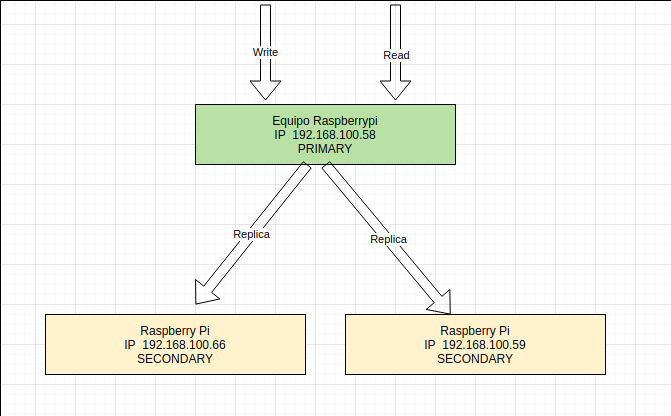

# Configuración del cluster para alta disponibilidad de la *base de datos*
Para la implementación de alta disponibilidad de la base de datos elegiremos 
la combinación CA (Consistency and Availability) mediante **Replica Set**


## a). Requisitos de hardware
Utilizaremos instancias de MongoDB instalados en nodos *Físicos*, Un nodo Primary instalado en el host y dos Secondaries configurados en dos Raspberry Pi
ilustraremos la siguiente configuración:



  - Nodo Primario Arch Linux 16gb RAM Core i7 8th gen 
  - Nodo Secundario Raspberry Pi 4/ Raspberry pi OS 4gb Ram 
  - Nodo Secundario Raspberry Pi 4/ Raspberry pi OS 4gb Ram

Notaremos que los tres nodos estan en la misma red.

## b). Requisitos de software
  Para el cluster necesitamos tener instalados mongoDB en todos los nodos.
  Tambien será necesario tener acceso a los dos nodos Raspberry Pi mediante SSH.

#### Instalar MongoDB
Instalar base de datos Mongo DB (version comunity)
#### Distribuciones basadas en Debian
Instalación de paquetes adicionales al sistema
```
sudo apt install dirmngr gnupg apt-transport-https software-properties-common ca-certificates curl
```
Adicionar la llave GPG de MongoDB al sistema
```
curl -fsSL https://www.mongodb.org/static/pgp/server-4.2.asc | sudo apt-key add -
```
Adicionar el repositorio de mongo al sistema
```
sudo add-apt-repository 'deb https://repo.mongodb.org/apt/debian buster/mongodb-org/4.2 main'
```
Instalar MongoDB
```
sudo apt update
sudo apt install mongodb-org
```
Habilitar el servicio de MongoDB en el sistema
```
sudo systemctl enable mongod --now
```
#### Distribuciones basadas en Arch Linux
Mongo ha sido quitado de los repositorios **Oficiales** de Arch Linux debido a problemas con el licenciamiento,
sin embargo se encuentra dispoble en los repositorios AUR y se lo puede instalar con cualquier manejador de paquetes de AUR como ser **yay**, de la siguiente manera:
```
yay -S mongodb-bin
```
Verificamos y/o habilitamos el servicio en el sistema.
```
sudo systemctl enable mongodb.service
sudo systemctl start mongodb.service
sudo systemctl status mongodb.service
```
## c) Configuración Replica Set
### Configuracion de los nodos

#### Registro de hosts y nombre de la replica en Primary y ambos Secondaries
Registrar los nombres e ips del cluster en en /etc/hosts de cada nodo.
podemos ejecutar las siguientes sentencias con el usuario root  como sigue:

Primary

Hosts
```
echo '127.0.0.1     primary'  >> /etc/hosts 
echo '192.168.100.5     secondary1'  >> /etc/hosts 
echo '192.168.100.66     secondary2'  >> /etc/hosts 
```
Secondary 1

Hosts
```
echo '127.0.0.1     secondary1'  >> /etc/hosts 
echo '192.168.100.23     primary'  >> /etc/hosts 
echo '192.168.100.66     secondary2'  >> /etc/hosts 
```

Secondary 2

Hosts
```
echo '127.0.0.1     secondary2'  >> /etc/hosts 
echo '192.168.100.23     primary'  >> /etc/hosts 
echo '192.168.100.66     secondary1'  >> /etc/hosts 
```
Editar /etc/mongodb.conf (como root) en todos los nodos incluido el Primary para que quede de la siguiente manera:
```
net: 
port: 2717
bindIp: 0.0.0.0
....
....
replication:
replSetName: "replica0"

```
#### Inicializacion del cluster
Primary

En la terminal ejecutar mongo y dentro ejecutar los siguientes comandos:
```
rs.initiate();
rs.add('secondary1:27017');
rs.add('secondary2:27017');
```
Secondary (en ambos)

Para habilitar consultas hacia el primario ejecutar mongo y dentro ejecutar los siguientes comandos:
```
rs.secondaryOk();
```

### Verificacion del cluster

En el nodo Primary ejecutar la siguiente sentencia
```
 rs.status()
```


