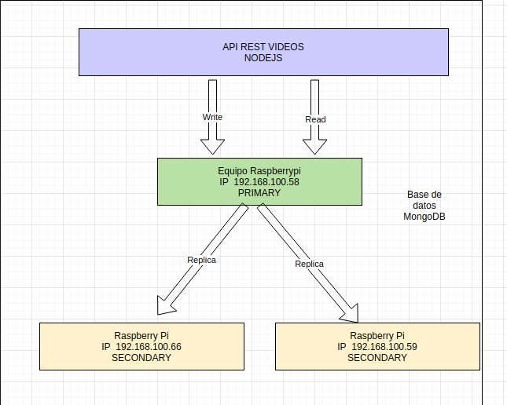

# Proyecto Final de Módulo
#### Maestría en Ciencia de Datos v2
#### Base de Datos Avanzadas
#### Universidad Católica Boliviana "San Pablo"
#### Ivan Fernando Mujica Mamani

## 1. Introducción
Este proyecto en una aplicacion de tipo API REST, el stack de tecnologías usado es:
  - Nodejs
    - Express
    - Mongoose
  - MongoDB  

La documentación de los servicios del API REST  se encuentrán en:
 > [http://localhost:1987/api-docs](http://localhost:1987/api-docs)

Describen la especificación de los servicios web, también como consumirlos.
Este conjunto de servicios satisfacen las reglas de negocio descritas a continuación:

## Reglas de negocio:
#### Gestión de Videos:
  1. Deseo registrar un nuevo video, guardando la siguiente información:

    a. Duración en minutos.
    b. Genero: Drama, Comedia, suspenso, etc.
    c. Titulo de la pelicula, con varios alternativos
    d. Año de publicacións.
    e. Que nominaciones a premios Oscar tuvo y cuales ganó.
    f. Principales actores de la película.
    g. Costo unitario de cada DVD.
    h. Número de unidades adquiridas.
  2. Registrar nuevas copias para una película.
  3. Registrar bajas de copias para una película, específicando la fecha de la baja y la razón (no devuelto,
robo, etc.)
#### Gestión de Clientes:
  1. Deseo poder registrar nuevos clientes, guardando la siguiente información.

    a. Nombre completo.
    b. Número de telefono celular.
    c. Correo electrónico.
    d. Fecha de Nacimiento.
    e. Dirección.
    f. Geolocalización de la dirección.
    g. Fecha de registro en la BBDD como cliente.
  2. Deseo poder actualizar los datos de los clientes cuando sea necesario.
  3. Deseo poder bloquear malos cliente registrando la fecha del bloqueo y la razón por la que se ha
dicididó bloquearlo (los clientes bloqueados no pueden rentar películas).
#### Gestión de Préstamos:
  1. Deseo podér registrar el prestamo de una película, para lo cual se realizan las siguientes actividades.

    a. Buscar película por nombre, genero, actor o nominaciones al Oscar.
    b. Agregar la película que se desea prestar.
    c. Buscar mas peliculas si el cliente desea llevar varias
    d. Registrar la fecha de devolución.
    e. Calcular el importe de acuerdo a la fecha de devolución.
    f. Emitir la factura con el importe total.
  2. Deseo poder definir y modificar costos por día de prestamo.

    a. 1 día: 2 Bs.
    b. 2 días: 3 Bs.
    c. 3 días: 4 Bs
    d. 4 dias: 5 Bs
    e. 5 dias: 6 Bs
    f. No deberían permitirse prestamos mayores a los dias configurados en el software
  3. Deseo poder definir y modificar descuentos por cantidad de películas.
    a. Si lleva de 3 a 5 peliculas 5% de descuento.
    b. Si lleva mas de 5 peliculas 10% de descuento.
### Casos de uso

### Solución


# 2. Instalación del proyecto
Para una correcta instalación ver el siguiente enlace:
> [INSTALL.md](INSTALL.md)
# 3. Configuración en alta disponibilidad de la base de datos.

> [CONFIG-HA.md](CONFIG-HA.md)

# 4. Entregables

  #### a) Diccionario de datos
> [DICCIONARIO](docs/diccionario.md)

  **Solo** si se quiere hacer una instalación de la base de datos y no asi de la aplicación
  ya que la misma crea  y realiza el poblado de la base datos con data de prueba como esta descrito en el punto 2.

  #### b) Script de creación de la base de datos.
  Ingresar a  mongoDB:
  ```sh
  mongo
  ```
  Crear la base de datos 
  ```
  use videos_standalone
  ```
  Verificar que estemos posicionado en la base de datos
  ```
  db
  ```
  Mongo no visualiza el nombre de la nueva base de datos al menos que no se tenga una colección creada.
  ```
  db.test.insert({foo: 'foo'});
  ```

  #### c) Script de llenado de la base de datos. 
  ```
  mongoimport --db videos_standalone --collection tarifas --drop --file bk/tarifas.json
  mongoimport --db videos_standalone --collection descuentos --drop --file bk/descuentos.json
  mongoimport --db videos_standalone --collection videos --drop --file bk/videos.json
  mongoimport --db videos_standalone --collection clientes --drop --file bk/clientes.json
  mongoimport --db videos_standalone --collection prestamos --drop --file bk/prestamos.json

  ```

  #### d) Consultas a la base de datos

  Si se ha realizado una restauración solamente de la base de datos podemos ejecutar las siguientes consultas solicitadas
  directamente en mongoDB, caso contrario usar los servicios descritos en el **APIDOC**

  Detalle de un prestamo
  ```javascript
      db.prestamos.aggregate([ 
        { '$match': { _id: ObjectId('000000000000000000000020') } }, 
        { '$lookup': 
          { from: 'clientes', localField: 'cliente', 
            foreignField: '_id', as: 'cliente' } },
        { '$unwind': '$cliente' }, 
        { '$project': { _id: 1, fechaDevolucion: 1, devuelto: 1, createAt: 1,
          diasPrestamo: 1, importeTotal: 1, descuento: 1,
          cliente: '$cliente.nombreCompleto', celular: '$cliente.celular',
          fechaNacimiento: '$cliente.fechaNacimiento',
          videos: 1 }
        },
        { '$unwind': '$videos' },
        { '$lookup': 
          { from: 'videos', localField: 'videos', foreignField: '_id', 
            as: 'videosDetalles' } }, 
        { '$unwind': '$videosDetalles' }, 
        { '$project': { _id: '$_id', fechaDevolucion: 1, 
          devuelto: 1, createAt: 1, cliente: 1, celular: 1, 
          diasPrestamo: 1, importeTotal: 1, descuento: 1, fechaNacimiento: 1,
          'video.titulo': '$videosDetalles.titulo', 
          'video.costoUnitario': '$videosDetalles.costoUnitario', 
          'video.reparto': '$videosDetalles.reparto', 
          'video.director': '$videosDetalles.director' } },
        { '$group': { _id: '$_id', 
          cliente: { '$first': '$cliente' }, 
          devuelto: { '$first': '$devuelto' },
          fechaNacimiento: { '$first': '$fechaNacimiento' }, 
          fechaDevolucion: { '$first': '$fechaDevolucion' }, 
          celular: { '$first': '$celular' },
          diasPrestamo: { '$first': '$diasPrestamo' }, 
          importeTotal: { '$first': '$importeTotal' }, 
          descuento: { '$first': '$descuento' },
          fechaPrestamo: { '$first': '$createAt' },
          videos: { '$push': '$video' } } 
        }
      ]).pretty()

  ```
  Historial de un cliente
  ```javascript

      db.prestamos.aggregate([
          {
            $match: { cliente: ObjectId('000000000000000000000001') } 
          },
          {
            $lookup: {
                      from: 'clientes',
                      localField: 'cliente',
                      foreignField: '_id',
                      as: 'cliente'
                    }
          },
          {
            $unwind: '$cliente'
          },
          {
            $project: {
              _id: 1,
              cliente: '$cliente.nombreCompleto',
              fechaPrestamo: '$createAt',
              videos: 1
            }
          },
          {
            $unwind: '$videos'
          },
          {
            $lookup: {
                      from: 'videos',
                      localField: 'videos',
                      foreignField: '_id',
                      as: 'videosDetalles'
            }
          },
          { $unwind: '$videosDetalles'},
          { $project: {
              '_id': '$_id',
              'clente': '$cliente',
              'fechaPrestamo': '$fechaPrestamo',
              'videoTitulo': '$videosDetalles.titulo'
            }
          }, 
          { $sort : { fechaPrestamo : -1 } },
          { "$group": {
                "_id": "$videoTitulo",
                count: { $sum: 1 },
                "fechas": { "$push": "$fechaPrestamo" },
            }
          }
        ]).pretty();
  ```
  Ranking de peliculas 
  ```javascript

      db.prestamos.aggregate([
        {
          $unwind: '$videos'
        },
        {
          $lookup: {
                    from: 'videos',
                    localField: 'videos',
                    foreignField: '_id',
                    as: 'videosDetalles'
          }
        },
        { $unwind: '$videosDetalles'},
        { $project: {
            '_id': '$_id',
            'fechaPrestamo': '$createAt',
            'videoTitulo': '$videosDetalles.titulo'
          }
        }, 
        { "$group": {
              "_id": "$videoTitulo",
              'cantidad': { $sum: 1 },
              "fechas": { "$push": "$fechaPrestamo" },
          }
        },
        { $sort : { 'cantidad' : -1 } },
      ]).pretty();

  ```


